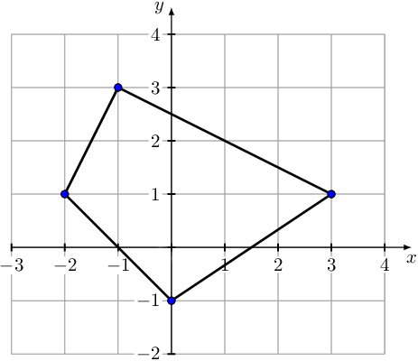
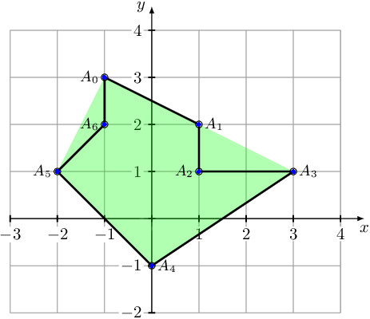

An array A of points in a 2D plane is given. These points represent a polygon: every two consecutive points describe an edge of the polygon, and there is an edge connecting the last point and the first point in the array.

A set of points in a 2D plane, whose boundary is a straight line, is called a semiplane. More precisely, any set of the form {(x, y) : ax + by ≥ c} is a semiplane. The semiplane contains its boundary.

A polygon is convex if and only if, no line segment between two points on the boundary ever goes outside the polygon.

For example, the polygon consisting of vertices whose Cartesian coordinates are consecutively:

  (-1, 3)   (3, 1)   (0, -1)   (-2, 1)
is convex.

The convex hull of a finite set of points in a 2D plane is the smallest convex polygon that contains all points in this set. For example, the convex hull of a set consisting of seven points whose Cartesian coordinates are:

  (-1, 3)   (1, 2)   (3, 1)   (1, 1)   (0, -1)   (-2, 1)  (-1, 2)
is a polygon that has five vertices. When traversed clockwise, its vertices are:

  (-1, 3)   (1, 2)   (3, 1)   (0, -1)   (-2, 1)

If a polygon is concave (that is, it is not convex), it has a vertex which does not lie on its convex hull border. Your assignment is to find such a vertex.

Assume that the following declarations are given:

from dataclasses import dataclass, field

@dataclass
class Point2D:
    x: int
    y: int

Write a function:

def solution(A)

that, given a non-empty array A consisting of N elements describing a polygon, returns −1 if the polygon is convex. Otherwise, the function should return the index of any point that doesn't belong to the convex hull border. Note that consecutive edges of the polygon may be collinear (that is, the polygon might have 180−degrees angles).

To access the coordinates of the K-th point (where 0 ≤ K < N), use the following syntax:

A[K].x to access the x-coordinate,
A[K].y to access the y-coordinate.
For example, given array A such that:

  A[0].x = -1  A[0].y =  3
  A[1].x =  1  A[1].y =  2
  A[2].x =  3  A[2].y =  1
  A[3].x =  0  A[3].y = -1
  A[4].x = -2  A[4].y =  1
the function should return −1, as explained in the example above.

However, given array A such that:

  A[0].x = -1  A[0].y =  3
  A[1].x =  1  A[1].y =  2
  A[2].x =  1  A[2].y =  1
  A[3].x =  3  A[3].y =  1
  A[4].x =  0  A[4].y = -1
  A[5].x = -2  A[5].y =  1
  A[6].x = -1  A[6].y =  2
the function should return either 2 or 6. These are the indices of the polygon lying strictly in its convex hull (that is, not on the convex hull border).

Write an efficient algorithm for the following assumptions:

N is an integer within the range [3..10,000];
the coordinates of each point in array A are integers within the range [−1,000,000,000..1,000,000,000];
no two edges of the polygon A intersect, other than meeting at their endpoints;
array A does not contain duplicate points.