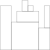

Problem: StoneWall
Task Description:
Given an array H of N positive integers representing the heights of a stone wall's sections, compute the minimum number of rectangular blocks needed to build the wall. Adjacent blocks must have different heights unless they are part of the same block.

Examples:
H = [8, 8, 5, 7, 9, 8, 7, 4, 8] → Returns 7

Blocks: [8], [5,7,9], [8], [7], [4], [8]

H = [1, 2, 3, 4, 5] → Returns 5 (each height needs a separate block)

Constraints:
N is within [1..100,000].

Each element in H is within [1..1,000,000,000].

Time: O(N)

Space: O(N)

   

> **Difficulty level**
> easy 

----

You are going to build a stone wall. The wall should be straight and N meters long, and its thickness should be constant; however, it should have different heights in different places. The height of the wall is specified by an array H of N positive integers. H[I] is the height of the wall from I to I+1 meters to the right of its left end. In particular, H[0] is the height of the wall's left end and H[N−1] is the height of the wall's right end.

The wall should be built of cuboid stone blocks (that is, all sides of such blocks are rectangular). Your task is to compute the minimum number of blocks needed to build the wall.

Write a function:

def solution(H)
content_copy

that, given an array H of N positive integers specifying the height of the wall, returns the minimum number of blocks needed to build it.

For example, given array H containing N = 9 integers:

H[0] = 8 H[1] = 8 H[2] = 5 H[3] = 7 H[4] = 9 H[5] = 8 H[6] = 7 H[7] = 4 H[8] = 8
content_copy
the function should return 7. The figure shows one possible arrangement of seven blocks.

Write an efficient algorithm for the following assumptions:

N is an integer within the range [1..100,000];
each element of array H is an integer within the range [1..1,000,000,000].